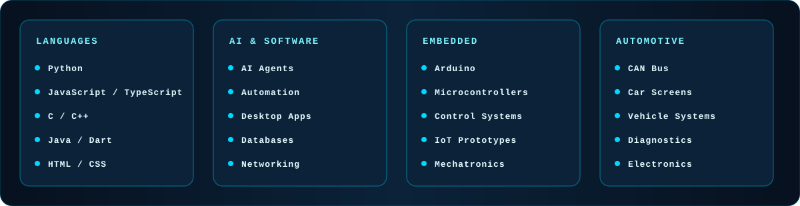

<!-- الصورة الرئيسية الأصلية المرفقة -->

 

---

`SOFTWARE ENGINEERING` &nbsp;•&nbsp; `ELECTRONICS` &nbsp;•&nbsp; `AI` &nbsp;•&nbsp; `AUTOMOTIVE`

## `01 / ABOUT ME`

> **I build systems where software meets the physical world.**

I’m **Abdulrahman Al-Zabidi**, a Software and Electronics Engineer from **Yemen**. I work at the intersection of software engineering, embedded systems, automotive technology, mechatronics, and artificial intelligence.

I enjoy transforming ideas into practical systems: desktop applications, database tools, Arduino prototypes, automotive electronics, and AI-powered workflows. My engineering loop is simple: understand the problem, design the system, build it carefully, test it honestly, and improve it continuously.

## `02 / WHAT I BUILD`

<table>
<tr>
<td width="50%" valign="top">

### `▣` SOFTWARE SYSTEMS

- Desktop and mobile applications
- Python automation and developer tooling
- Web applications and utilities
- Database-backed systems
- AI-assisted workflows and agents

</td>
<td width="50%" valign="top">

### `⌁` CONNECTED ELECTRONICS

- Arduino and microcontroller projects
- Embedded control systems
- CAN Bus and automotive electronics
- Mechatronics prototypes
- Hardware–software integration

</td>
</tr>
</table>

## `03 / TECHNOLOGY STACK`

## `04 / CURRENT FOCUS`

| Focus area | Direction |
|:---:|:---|
| `01` | Advanced Python architecture and automation |
| `02` | AI agents and practical machine-learning systems |
| `03` | Embedded control and microcontroller integration |
| `04` | Automotive electronics and vehicle communication |

## `05 / SELECTED PROJECTS`

<table>
<tr>
<td width="33%" valign="top">

### `01` PLAYSTATION MANAGEMENT

A desktop management system for PlayStation environments with local data handling and practical automation.

`Python` `SQLite` `Arduino`

[Explore project →](https://github.com/user-hasan/psmanager-releases)

</td>
<td width="33%" valign="top">

### `02` CITY OF AI AGENTS

A file-first AI orchestration system designed for modular agent-based workflows.

`Python` `AI` `Agents`

[Explore project →](https://github.com/user-hasan/CityOfAIAgents)

</td>
<td width="33%" valign="top">

### `03` MY SKILLS

A catalog of reusable AI skills for organizing and extending AI-assisted workflows.

`Python` `AI` `Automation`

[Explore project →](https://github.com/user-hasan/ai-skills-catalog)

</td>
</tr>
</table>

## `06 / ENGINEERING MINDSET`

 

**I don’t just write code. I build systems.**

## `07 / AREAS OF INTEREST`

&nbsp;&nbsp;
&nbsp;&nbsp;
&nbsp;&nbsp;
&nbsp;&nbsp;
&nbsp;&nbsp;
&nbsp;&nbsp;

 

&nbsp;&nbsp;
&nbsp;&nbsp;
&nbsp;&nbsp;
&nbsp;&nbsp;
&nbsp;&nbsp;
&nbsp;&nbsp;
&nbsp;&nbsp;

  

`AI / ML` &nbsp;•&nbsp; `Embedded Systems` &nbsp;•&nbsp; `CAN Bus` &nbsp;•&nbsp; `Automotive Electronics`

 

`Mechatronics` &nbsp;•&nbsp; `Desktop Development` &nbsp;•&nbsp; `Databases` &nbsp;•&nbsp; `Networking` &nbsp;•&nbsp; `Automation`

## `08 / CONNECT`

&nbsp;&nbsp;
&nbsp;&nbsp;
&nbsp;&nbsp;
&nbsp;&nbsp;

 

`LinkedIn` &nbsp;•&nbsp; `Facebook` &nbsp;•&nbsp; `Instagram` &nbsp;•&nbsp; `Telegram` &nbsp;•&nbsp; `Email`

  

### `Share your imagination. Let’s turn it into reality.`

<!--
CUSTOMIZATION NOTES
1. The original main image is intentionally kept as the first visual: ./assets/profile-readme-banner.jpg
2. All important visual assets are local SVG/PNG files, so they do not depend on external image services.
3. Replace the social links and YOUR_EMAIL@example.com with real contact details when ready.
-->
