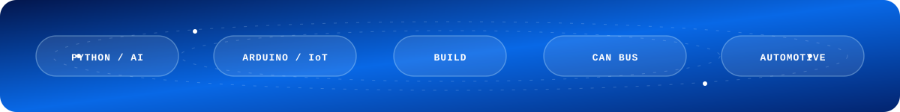
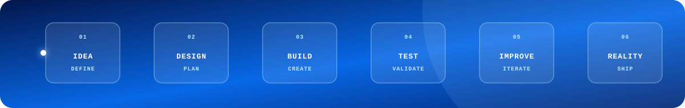

 

 

---

## `01 / PROFILE`

> **I build systems where software meets the physical world.**

I’m **Abdulrahman Al-Zubaidi**, a Software and Electronics Engineer from **Yemen**. I combine software engineering, embedded systems, automotive technology, mechatronics, and artificial intelligence to turn ideas into practical systems.

My work ranges from desktop applications and database tools to Arduino prototypes, automotive electronics, AI workflows, and hardware–software integration. I learn by building, validate by testing, and improve through iteration.

## `02 / WHAT I BUILD`

<table>
<tr>
<td width="50%" valign="top">

### `▣` Software Systems

- Desktop and mobile applications
- Python automation and tooling
- Web applications and developer utilities
- Database-backed systems
- AI-assisted workflows and agents

</td>
<td width="50%" valign="top">

### `⌁` Connected Electronics

- Arduino and microcontroller projects
- Embedded control systems
- CAN Bus and automotive electronics
- Mechatronics prototypes
- Hardware–software integration

</td>
</tr>
</table>

## `03 / CURRENT FOCUS`

| Focus | Direction |
|:---:|:---|
| `01` | Advanced Python architecture and automation |
| `02` | AI agents and practical machine-learning systems |
| `03` | Embedded control and microcontroller integration |
| `04` | Automotive electronics and vehicle communication |

## `04 / TECHNOLOGY STACK`

  

  

## `05 / SELECTED PROJECTS`

<table>
<tr>
<td width="33%" valign="top">

### `01` PlayStation Management

Desktop management system for PlayStation environments with local data handling and practical automation.

`Python` `SQLite` `Arduino`

[Explore project →](https://github.com/user-hasan/psmanager-releases)

</td>
<td width="33%" valign="top">

### `02` City of AI Agents

File-first AI orchestration system designed for modular agent-based workflows.

`Python` `AI` `Agents`

[Explore project →](https://github.com/user-hasan/CityOfAIAgents)

</td>
<td width="33%" valign="top">

### `03` My Skills

Reusable AI skills that organize and extend AI-assisted development workflows.

`Python` `AI` `Automation`

[Explore project →](https://github.com/user-hasan/ai-skills-catalog)

</td>
</tr>
</table>

## `06 / ENGINEERING LOOP`

 

**I don’t just write code. I build systems.**

## `07 / AREAS OF INTEREST`

`Software Engineering` · `Python` · `AI / ML` · `Embedded Systems`

`Arduino` · `CAN Bus` · `Automotive Electronics` · `Mechatronics`

`Desktop Development` · `Databases` · `Networking` · `Automation`

## `08 / GITHUB ACTIVITY`

 

## `09 / CONNECT`

  

### `Share your imagination. Let’s turn it into reality.`

<!--
CUSTOMIZATION NOTES
1. Replace user-hasan with your exact GitHub username if needed.
2. Replace the social links and YOUR_EMAIL@example.com with your real profiles.
3. The key animated visuals are local SVG files in ./assets, so they remain available in the repository.
-->
